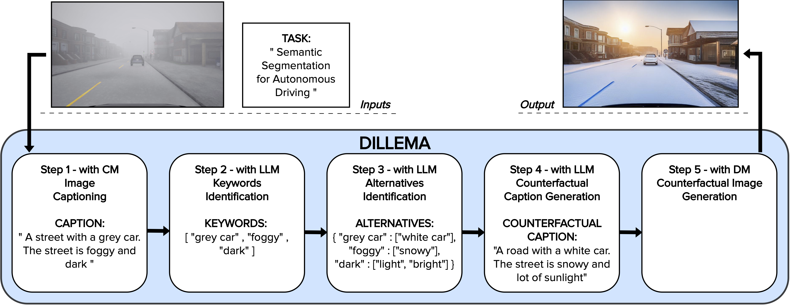

# DILLEMA: Diffusion and Large Language Models for Multi-Modal Augmentation

[Luciano Baresi](https://baresi.faculty.polimi.it/), [Davide Yi Xian Hu](https://dragonbanana.github.io/), [Muhammad Irfan Mas'udi](https://irfanmasoudi.github.io/), [Giovanni Quattrocchi](https://quattrocchi.faculty.polimi.it/#/)

[](https://arxiv.org/abs/2502.04378)

A framework that enhances the robustness of DL-based systems by generating diverse, realistic test images from existing datasets. DILLEMA leverages the recent advances in text and visual models to generate synthetic and accurate images to test DL-based systems in scenarios and conditions that can be not represented in the existing testing suite as data augmentation.



DILLEMA has 5 step processes:
1. Image Captioning: the process of converting a given image into a detailed textual description.
2. Keywords Identification: aims to identify which elements of the image can be safely modified without altering the overall meaning.
3. Alternatives Identification: explore different possibilities for modifying the elements flagged in the previous step, such as changing the color of objects, adjusting environmental conditions (e.g., weather).
4. Counterfactual Caption Generation: creating new textual descriptions, or counterfactual captions, by applying the alternatives generated in the previous step.
5. Conterfactual Image Generation: generates a modified image based on the counterfactual caption.

In the deployment, we decided to convert into 3 processes, image captioning, generating counterfactual, and image generation. Generating counterfactual actually combining step 2, 3, and 4. We do that for just the matter of computational resource efficiency.

## Getting Started
Environment installation, we are using Conda which tested and work properly using ```Python >= 3.10```. Then install all requirement.

```
git clone https://github.com/irfanmasoudi/DILLEMA.git
cd DILLEMA
pip install -r requirements.txt
```
Counterfactual generation need LLMs pretrained model, we use LLaMA-2. We use quantized 5-bit precision. But, you can change with other quantization.

```
python3 downloadLLAMA.py
```

## Datasets
1. ```SHIFT``` dataset is the Semantic Segmentation task example (synthetic dataset for autonomous driving).

<br /><br />


3. ```ImageNet1K``` is the example dataset for image classification which use used to train ResNet18, ResNet50, and ResNet152.

<br /><br />

## Image Captioning
In the experiment we deployed ImageNet1K and SHIFT dataset. ```DILLEMA_captioning_imagenet.py``` for ImageNet1K and ```DILLEMA_captioning_shift.py```. The only different is in the dataset root path, captioning result folder path and the data loader.

```
cd captioning
python3 DILLEMA_captioning_imagenet.py
```

## Counterfactual Generation
Generating counterfactual will have the same setting with Image Captioning. For the initial setting, counterfactual generation need also set the task specification ```
task = "ImageNet image classification with 1000 labels"```. 
The ImageNet1K in our the experiment, adding the label into LLMs prompt getting a better result compare to if we are not put in the prompt. In the counterfactual directory you can see also the setting for limiting the counterfactual result for 25 images per class and with percentage iteration condition with this script ```DILLEMA_counterfactual_imagenet_limit25.py```. If you need to run all the dataset, you can use:

```
cd counterfactual
python3 DILLEMA_counterfactual_imagenet.py
```
There is also some possible error due to LLMs response that not comply with the format specifications. Then you can also run the bash script run.sh.

```
#!/bin/bash
while true
do
 python3 DILLEMA_counterfactual_imagenet.py || echo "Error... restarting..." >&2
 echo "Press Ctrl-C to quit." && sleep 1
done

```

## Image Generation
Controlling the Diffusion Model with conditioning mechanism, spatial context and text descriptions is an important component in the DILLEMA Image generation. 

```
cd imagegen
DILLEMA_imagegen_imagenet.py
```


