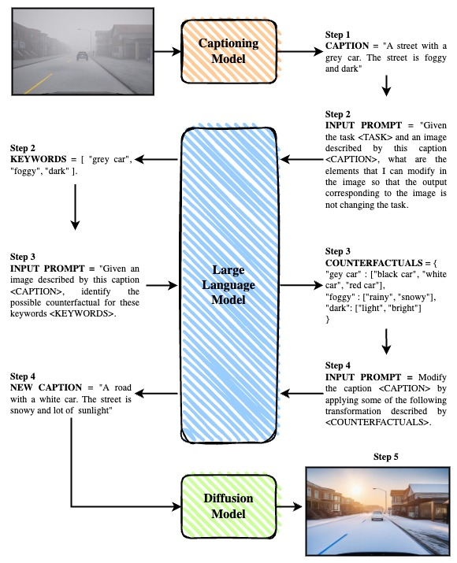

# DILLEMA


DILLEMA: Diffusion Model and Large Language Model for Augmentation to perform counterfactual generation and data augmentation as the generated test cases for metamorphic testing. DILLEMA will have five-step processes from the input image to generate the image result.



DILLEMA has 5 step processes:
1. The input image will be described as text with an image captioning model, the result provides some sentences related to the input image that describe it as a caption.
2. The Large Language Model will take place in order to find several words that can be modified to correspond to the description of the caption without changing the task objective with the expected result as the list of Keywords
3. Given the specific task, and the caption (the original text description of image input), the Large Language Model asked to identify the possible counterfactual words of the Keywords, with the expected result and specific format. 
4. Change the Keywords with their alternatives into complete sentences that will describe the output of the image as a new caption. 
5. Controlling Diffusion Model generates a new image, based on the original image and new caption.

In the deployment, we decided to convert into 3 processes, image captioning, generating counterfactual, and image generation. Generating counterfactual actually combining step 2, 3, and 4. We do that for just the matter of computational resource efficiency.

## Getting Started
Environment installation, we are using Conda which tested and work properly using ```Python >= 3.10```. Then install all requirement.

```
git clone https://github.com/irfanmasoudi/DILLEMA.git
cd DILLEMA
pip install -r requirements.txt
```
For the 


