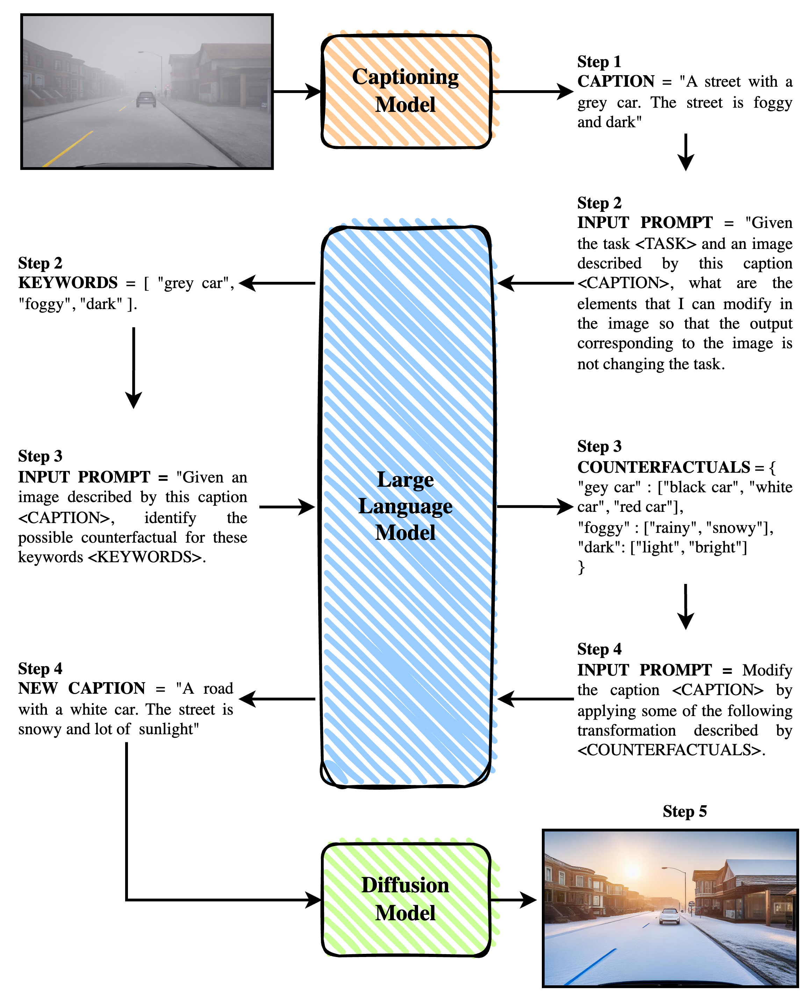

# DILLEMA


DILLEMA: Diffusion Model and Large Language Model for Augmentation to perform counterfactual generation and data augmentation as the generated test cases for metamorphic testing. DILLEMA will have five-step processes from the input image to generate the image result.



DILLEMA has 5 step processes:
1. The input image will be described as text with an image captioning model, the result provides some sentences related to the input image that describe it as a caption.
2. The Large Language Model will take place in order to find several words that can be modified to correspond to the description of the caption without changing the task objective with the expected result as the list of Keywords
3. Given the specific task, and the caption (the original text description of image input), the Large Language Model asked to identify the possible counterfactual words of the Keywords, with the expected result and specific format. 
4. Change the Keywords with their alternatives into complete sentences that will describe the output of the image as a new caption. 
5. Controlling Diffusion Model generates a new image, based on the original image and new caption.

In the deployment, we decided to convert into 3 processes, image captioning, generating counterfactual, and image generation. Generating counterfactual actually combining step 2, 3, and 4. We do that for just the matter of computational resource efficiency.

## Getting Started
Environment installation, we are using Conda which tested and work properly using ```Python >= 3.10```. Then install all requirement.

```
git clone https://github.com/irfanmasoudi/DILLEMA.git
cd DILLEMA
pip install -r requirements.txt
```
Counterfactual generation need LLMs pretrained model, we use LLaMA-2. We use quantized 5-bit precision. But, you can change with other quantization.

```
python3 downloadLLAMA.py
```
## Image Captioning
In the experiment we deployed ImageNet1K and SHIFT dataset. ```DILLEMA_captioning_imagenet.py``` for ImageNet1K and ```DILLEMA_captioning_shift.py```. The only different is in the dataset root path, captioning result folder path and the data loader.

```
cd captioning
python3 DILLEMA_captioning_imagenet.py
```

## Counterfactual Generation
Generating counterfactual will have the same setting with Image Captioning. For the initial setting, counterfactual generation need also set the task specification ```
task = "ImageNet image classification with 1000 labels"```. 
The ImageNet1K in our the experiment, adding the label into LLMs prompt getting a better result compare to if we are not put in the prompt. In the counterfactual directory you can see also the setting for limiting the counterfactual result for 25 images per class and with percentage iteration condition with this script ```DILLEMA_counterfactual_imagenet_limit25.py```. If you need to run all the dataset, you can use:

```
cd counterfactual
python3 DILLEMA_counterfactual_imagenet.py
```
There is also some possible error due to LLMs response that not comply with the format specifications. Then you can also run the bash script run.sh.

```
#!/bin/bash
while true
do
 python3 DILLEMA_counterfactual_imagenet.py || echo "Error... restarting..." >&2
 echo "Press Ctrl-C to quit." && sleep 1
done

```

## Image Generation
Controlling the Diffusion Model with conditioning mechanism, spatial context and text descriptions is an important component in the DILLEMA Image generation. 

```
cd imagegen
DILLEMA_imagegen_imagenet.py
```


